Before going to the level 01, you should visit to their site which is [[http://io.netgarage.org]{.underline}](http://io.netgarage.org/) . In this site they mention everything about the event as well as how to login into the level 01.

You can use either Linux OS or else Windows OS. I am going to use Linux OS (Xubuntu) because it is really easy. By using "ssh" we can login into this level. Windows users can use "Putty.exe" \[[[https://www.putty.org/]{.underline}](https://www.putty.org/) - If you haven't you can download it from here.\] which is "ssh client" for the Windows.

Putty guide :
\[[[https://www.ssh.com/ssh/putty/windows]{.underline}](https://www.ssh.com/ssh/putty/windows)\]

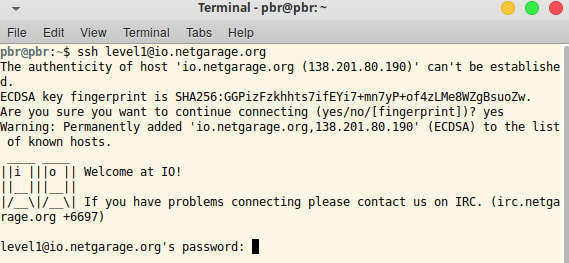

After login into the level they will have give again brief idea about the level and also about the CTF.

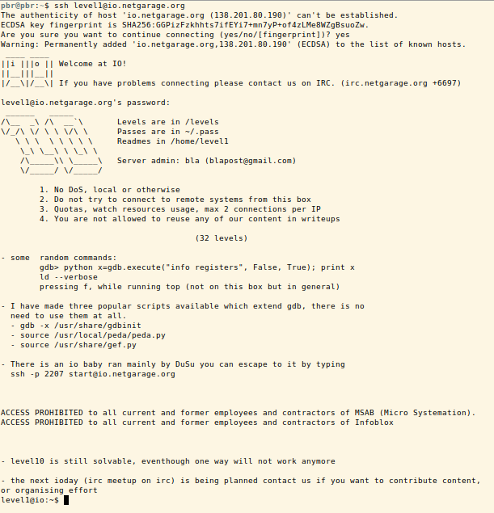

You should read each and every instructions are given. This CTF is created on the Linux environment. Then we can try some Linux commands on here as well because creator can be restricted some special kind of commands. First of all we should check file list which are on the current directory. By using "ls" command we can check them.

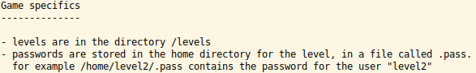

Here is the files which are on the current directory. There are few "README" files with few different languages. You should read one of them because there are some special instructions about the level.

In the README file they have given these "Game specifics" and they mentioned all the levels are in the directory "/levels". We should go into the mentioned directory.

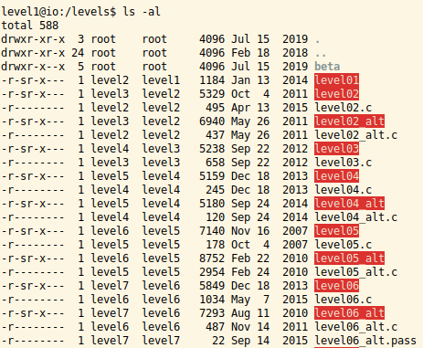

These are the files which are regarding to every and each levels. In above picture you can see set of files which are related to the levels. Most of the files are executable and you can see "owners" as well as "groups" of the files. Then to access those file you have reach each and every levels.

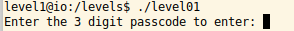

We are on level01 and let's try to access that "level01" file. That file is executable one.

After executing that it asked three digit pass code to unlock that relevant step. Then we should find that key or a pass code. Let's try different way to find out that pass code. This level01 file could be generated from the "C file". Then their should be a "main()" function. To find that function, we can use reverse engineering mechanism. This is the best part of this level. Let's see how is going on.

First of all we should disassemble the code which is written on that level01 file. Because if we open that file with notepad or something else we can see some byte code which human can't read on it. So we have to have used "gdb" tool \[[[https://www.gnu.org/software/gdb/]{.underline}](https://www.gnu.org/software/gdb/) \] for disassemble that code.

Gdb guide :
\[[[https://www.geeksforgeeks.org/gdb-step-by-step-introduction/]{.underline}](https://www.geeksforgeeks.org/gdb-step-by-step-introduction/)\]

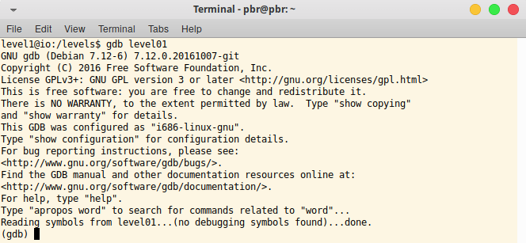

After going in to the gdb console, we should find what are functions in this particular file. To find that follow the instructions which are given below with the screenshot.

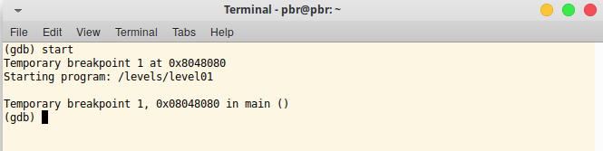

Then we can see the main() function with the temporary breakpoint. We also can add breakpoints to the code.

Gdb breakpoint guide:
\[[[https://ftp.gnu.org/old-gnu/Manuals/gdb/html\_node/gdb\_27.html]{.underline}](https://ftp.gnu.org/old-gnu/Manuals/gdb/html_node/gdb_27.html)\]

Now we can disassemble the main() function.

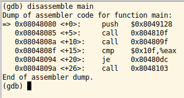

So if you can't understand this format, we can change this format into another format which is related to Intel.

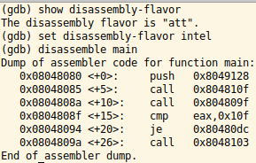

Above picture will guide you to change disassembly-flavor, current to another one. In here there are few technical words which are created using assemble language.

Assembly syntax guide:
\[[[https://www.cs.virginia.edu/\~evans/cs216/guides/x86.html]{.underline}](https://www.cs.virginia.edu/~evans/cs216/guides/x86.html)\]

I am not going to guide those every syntax, and I have given you a link which is fully guided about the relevant area. Please go through it.

This code segment should be passing that three digit pass code. Then there should be a method to compare "pass code" and "your input". In assembly language we are using "cmp" to compare two parameters. In this main function in line 4 there is "cmp" function.

>0x0804808f \<+15\>: cmp \$0x10f,%eax

               or

>0x0804808f \<+15\>: cmp eax,0x10f

In those lines (same line with two disassemble-flavors) said, compare "value which is on 0x10f memory address" and "which we are inputted value". Then we can print and see that alue which is on 0x10f memory address. That value could be the pass code.

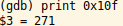

Let's try this code as that level01 pass code.

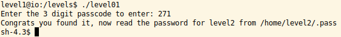

Great! You got the pass code, and they said that level2 password is stored inside "/home/level2/.pass" file. Then you can access that file and find next level password.

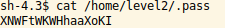

Congratulations!!! Now you have level02 password. And thank you all see you on next time with level02 walkthrough.
